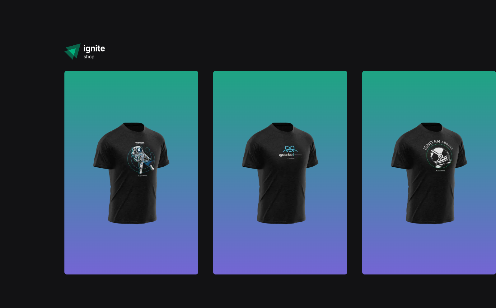
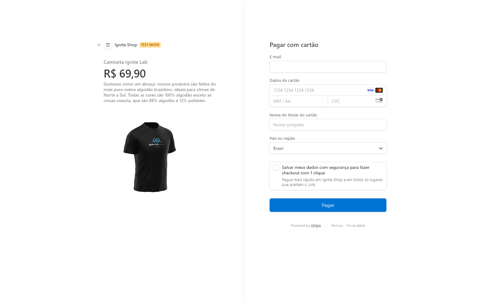

<h1 align="center">Ignite shop</h1>




<br>

## Introduction

#### Project build with NextJS, ReactJS and Typescript. This project is a part of the ReactJS course from [Rocketseat](https://www.rocketseat.com.br/).

<p>The application use Stripe API to supply with products and a payment method to a fictitious web shop.</p>

#### I've deepened on some concepts as...

- SSR, STG, data fetching, API Routes, Pages Router.

## Features

- Use Stripe API to control products and payment method on app.
- The app is ready to purchase a product.
- A page will load if the purchase is successful.
- The app is ready to decline a purchase on payment page.
- On payment page there is a button to cancel the payment and back to app.

## Upcoming features

- [ ] Add products to a cart.

## For run

#### Clone the repository and install dependencies.

```bash
git clone https://github.com/andresilveira1/ignite-shop.git

npm install

npm run dev
```
